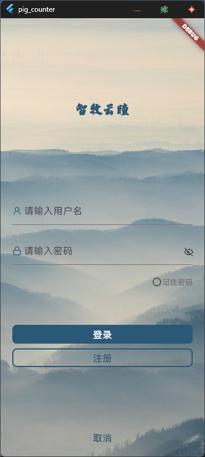
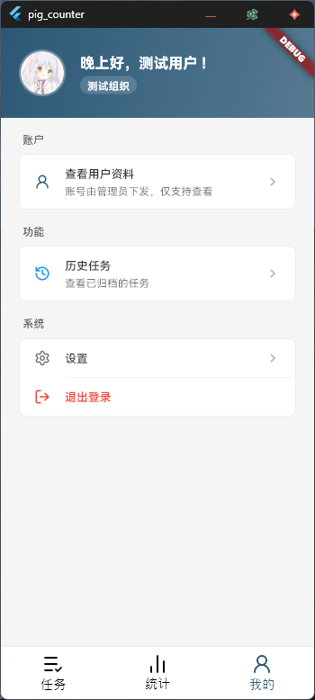
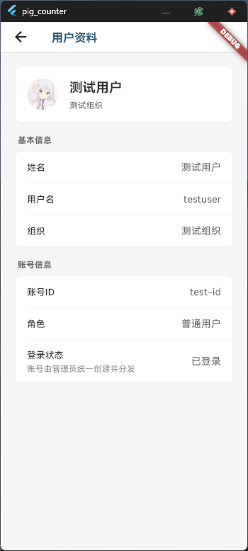
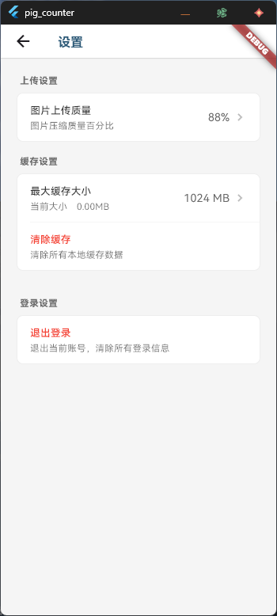
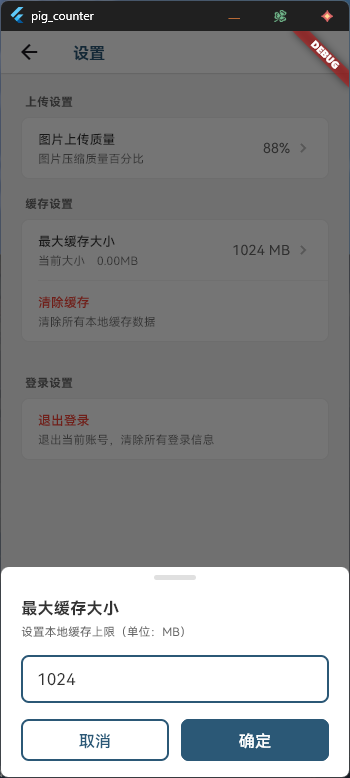
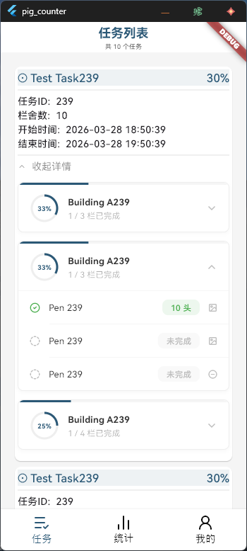
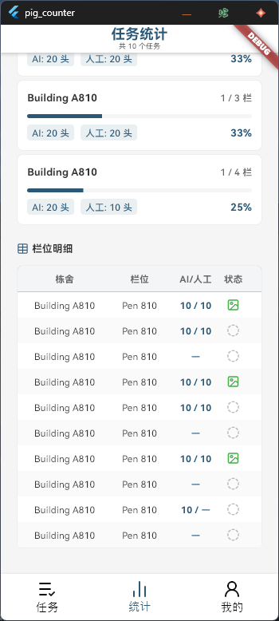
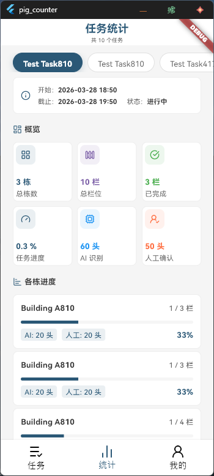
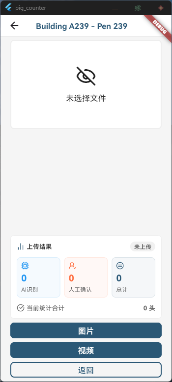

## 项目状态

**开发中**

当前功能与界面仍在持续迭代，下面截图用于展示现阶段主要页面。

## 简要介绍

- 提供账号登录与基础设置能力。
- 支持任务列表浏览、栋舍/栏位进度查看。
- 支持任务统计与栏位明细查看。
- 支持栏位图片/视频上传与结果确认。
- 支持用户资料查看（账号由管理员统一下发）。

## 界面展示

### 登录

### 我的与账号

| 我的页面                               | 用户资料                          |
| -------------------------------------- | --------------------------------- |
|  |  |

### 设置

| 设置页                              | 设置输入弹窗                                    |
| ----------------------------------- | ----------------------------------------------- |
|  |  |

### 任务

### 统计

| 统计总览                                | 统计明细                           |
| --------------------------------------- | ---------------------------------- |
|  |  |

### 上传

